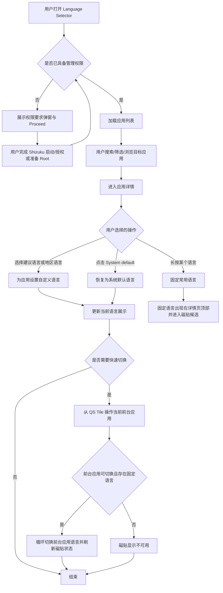
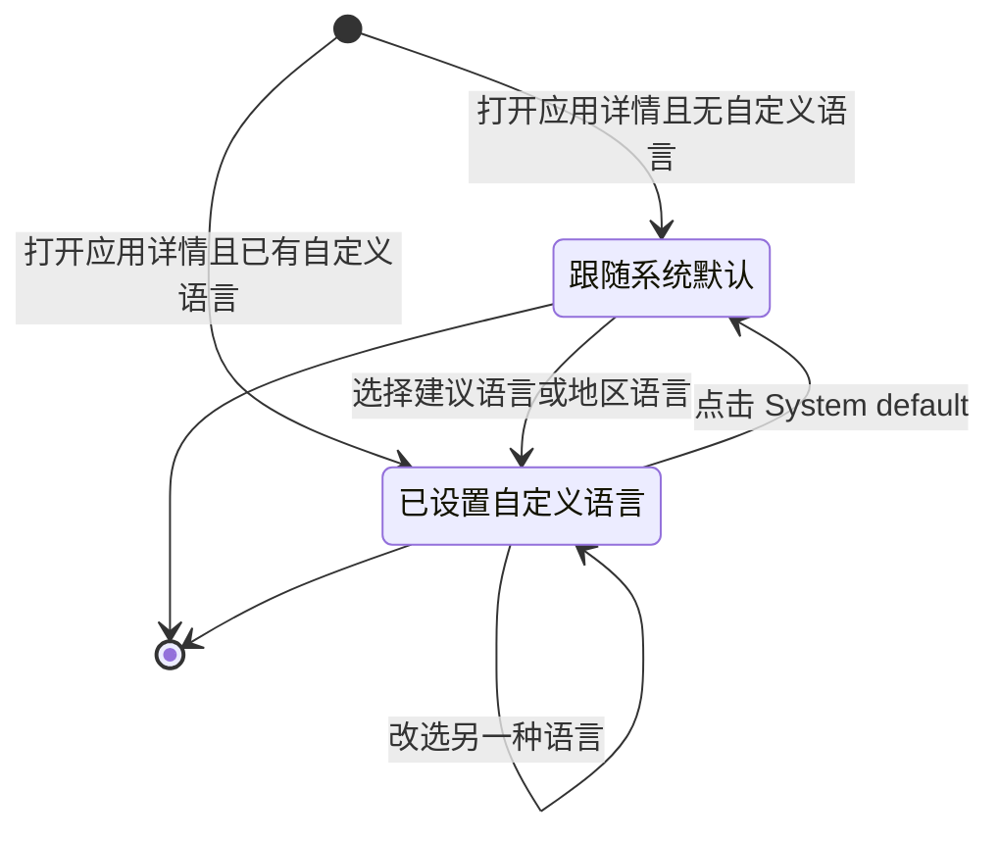
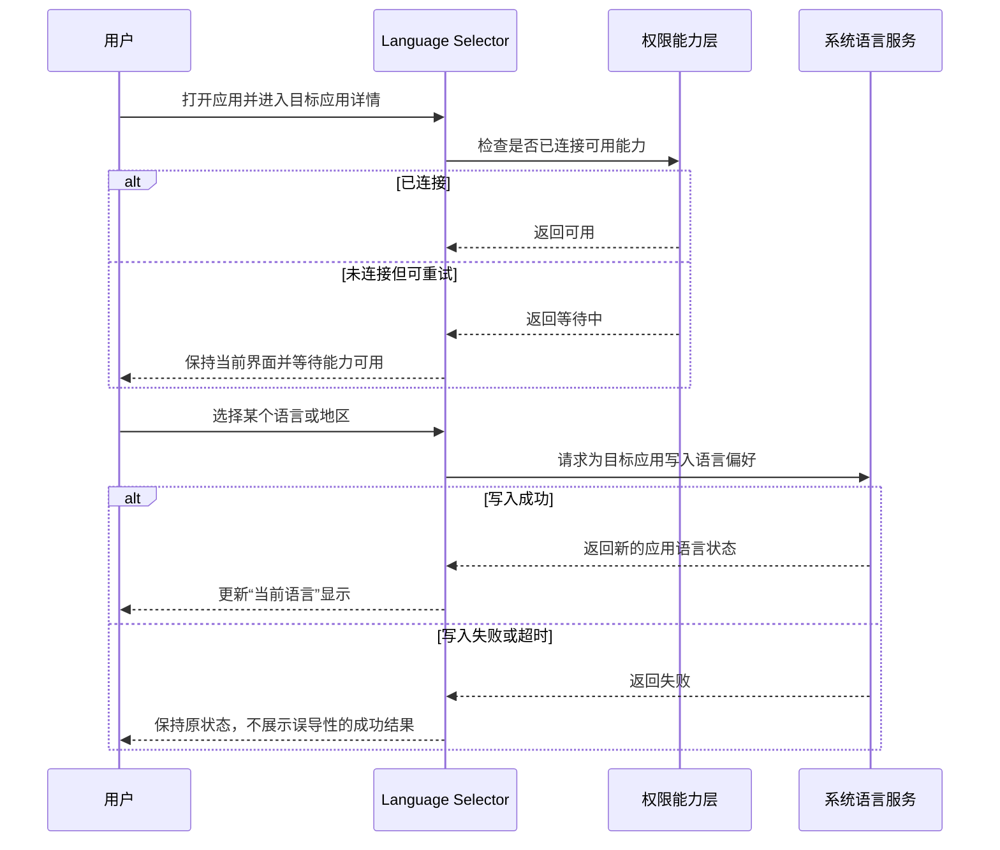

# 产品需求文档：Language Selector（单应用语言切换工具） - V0.1

## 1. 综述 (Overview)
### 1.1 项目背景与核心问题
Language Selector 是一款面向 Android 13 及以上设备的单应用语言切换工具，用来弥补部分 ROM 虽已具备系统级 App Language 能力、但没有提供官方 UI 入口的问题。目标用户通常具备较强动手能力，愿意通过 Shizuku 或 Root 获取受限系统能力，并希望以低门槛方式完成“为指定应用单独指定 Locale”的操作，而不是反复依赖 ADB 命令。

本产品解决的核心问题有三类：
1. 用户无法在系统设置中直接找到“应用语言”入口，但设备底层实际上支持该能力。
2. 用户希望按应用维度切换语言，而不是修改整机语言环境。
3. 用户存在高频切换需求，希望将常用语言固定下来，并通过快捷设置磁贴快速轮换。

当前版本聚焦“前端管理入口”能力，而非翻译能力本身。产品只负责为目标应用写入期望 Locale；如果应用自身不支持该语言，界面可能不会按预期变化。对于系统应用，虽然当前版本允许查看与显示，但切换结果存在不确定性，因此只应作为受限场景能力对待，而不作为核心承诺。

### 1.2 核心业务流程 / 用户旅程地图
1. **阶段一：环境准备** - 用户确认设备满足 Android 13+ 条件，并通过 Shizuku 或 Root 让应用具备管理单应用语言的能力。
2. **阶段二：发现目标应用** - 用户在首页浏览、搜索、筛选应用列表，识别已修改应用与系统应用，并进入目标应用详情页。
3. **阶段三：设置应用语言** - 用户查看目标应用当前语言，从建议语言、固定语言或完整语言列表中选择目标 Locale，必要时恢复系统默认。
4. **阶段四：高频切换** - 用户通过长按固定常用语言，并在快捷设置磁贴中对当前前台应用循环切换固定语言。

### 1.3 Mermaid 图（流程/状态/时序）
> 说明：以下内容基于当前仓库实现整理，目的是对齐“现有产品能力与应保持的交互约束”。

#### 1.3.1 用户操作流（必填）


#### 1.3.2 状态机（当存在明确状态流转对象时必填）


#### 1.3.3 关键场景时序（仅当“时序/并发/重试/超时”影响用户可见结果时填写）


## 2. 用户故事详述 (User Stories)

### 阶段一：环境准备

---

#### **US-01: 作为 Android 13+ 用户，我希望在进入功能前先确认是否具备必要权限，以便判断当前设备能否管理单应用语言。**
*   **价值陈述 (Value Statement)**:
    *   **作为** 需要单独管理应用语言的 Android 用户
    *   **我希望** 应用在启动时明确告诉我是否已经具备 Shizuku 或 Root 能力
    *   **以便于** 我能在开始操作前快速完成准备，避免进入半可用状态
*   **业务规则与逻辑 (Business Logic)**:
    1.  **前置条件**: 用户设备需为 Android 13 及以上；若无 Root，则需已安装并启动 Shizuku，且当前应用已获得授权。
    2.  **操作流程 (Happy Path)**:
        - 用户启动应用后，系统优先检查 Root 可用性，其次检查 Shizuku 连接与权限状态。
        - 若任一能力可用，应用进入“可管理态”，开始加载应用列表。
        - 若能力不可用，应用展示不可关闭的权限要求弹窗，文案明确说明 Shizuku 为必需前提，并提供 `Proceed` 重试入口。
        - 用户完成权限准备后再次点击 `Proceed`，应用重新检测并进入可管理态。
    3.  **异常处理 (Error Handling)**:
        - 若用户未完成 Shizuku 启动或授权，则必须持续停留在权限要求态，不能误导用户进入可操作列表。
        - 若服务连接长期不可用，则前台页面应继续保持阻塞，不展示已加载成功的假象。
        - 若设备不满足 Android 13+ 前置条件，则该版本不承诺兼容性，相关场景视为不支持范围。
*   **验收标准 (Acceptance Criteria)**:
    *   **场景1: 已具备管理能力时进入首页**
        *   **GIVEN** 用户设备满足系统要求，且 Root 或 Shizuku 权限已可用
        *   **WHEN** 用户启动应用
        *   **THEN** 应用直接进入加载态，并在加载完成后展示应用列表
    *   **场景2: 未具备权限时阻塞进入**
        *   **GIVEN** 用户尚未启动 Shizuku 或尚未向应用授权
        *   **WHEN** 用户启动应用
        *   **THEN** 应用必须展示权限要求弹窗，且不能让用户误以为列表已可操作
    *   **场景3: 点击 Proceed 后重新检测**
        *   **GIVEN** 用户已在后台完成 Shizuku 启动与授权
        *   **WHEN** 用户回到应用并点击 `Proceed`
        *   **THEN** 应用应重新检测能力状态，并在成功后进入可管理态
---
*   **页面布局线框图 (ASCII Wireframe)**:
    ```text
    +--------------------------------------------------+
    | Language Selector                                |
    +--------------------------------------------------+
    |                                                  |
    |                 [ Warning Icon ]                 |
    |                                                  |
    |  权限必需                                         |
    |  本应用需要 Shizuku 或 Root 能力后才可继续。       |
    |  请先完成启动与授权，再返回点击 Proceed。          |
    |                                                  |
    |                 [ Proceed ]                      |
    |                                                  |
    +--------------------------------------------------+
    ```
---

### 阶段二：发现目标应用

---

#### **US-02: 作为需要切换应用语言的用户，我希望能快速找到目标应用，以便尽快进入语言设置页。**
*   **价值陈述 (Value Statement)**:
    *   **作为** 设备中安装了大量应用的用户
    *   **我希望** 首页提供浏览、搜索、历史与筛选能力
    *   **以便于** 我能更快定位需要修改语言的目标应用
*   **业务规则与逻辑 (Business Logic)**:
    1.  **前置条件**: 应用已进入可管理态，并成功读取设备中已安装且已启用的应用列表；应用自身需从结果中排除。
    2.  **操作流程 (Happy Path)**:
        - 首页先展示加载态，完成后渲染应用列表。
        - 列表默认按“已修改应用优先、再按应用名升序”排序。
        - 默认情况下，系统应用不在首页普通列表中展示；但已被修改过的系统应用应继续可见，避免用户失去回访入口。
        - 用户可通过顶部搜索栏输入关键词，搜索范围覆盖应用名与包名。
        - 搜索展开但未输入时，展示最近访问历史；用户点击某项后进入详情页，同时该访问行为写入历史记录。
        - 用户可通过搜索结果中的标签筛选“系统应用”与“已修改应用”，并可通过更多菜单切换首页是否显示系统应用、进入 About 页面。
        - 当用户从详情页返回且目标应用的修改状态发生变化时，该应用应在列表中重新排序，并允许用户通过 Snackbar 快速滚动定位。
    3.  **异常处理 (Error Handling)**:
        - 若应用列表仍在加载，必须展示明确的加载中状态，避免空白页误判。
        - 若搜索无结果，页面至少应保留搜索框与已有筛选条件，不得破坏当前输入状态。
        - 清空历史记录时，只能清空最近访问记录，不能影响应用实际的语言设置状态。
*   **验收标准 (Acceptance Criteria)**:
    *   **场景1: 默认列表排序与可见性**
        *   **GIVEN** 用户已进入首页，且设备上同时存在普通应用、系统应用与已修改应用
        *   **WHEN** 列表加载完成
        *   **THEN** 已修改应用应排在前面，未修改的系统应用默认不显示
    *   **场景2: 搜索并筛选目标应用**
        *   **GIVEN** 用户已展开搜索栏
        *   **WHEN** 用户输入应用名或包名，并勾选“已修改应用”筛选
        *   **THEN** 结果列表只展示命中关键词且满足标签条件的应用
    *   **场景3: 展示与清空历史**
        *   **GIVEN** 用户之前访问过多个应用详情页
        *   **WHEN** 用户展开搜索栏但不输入内容
        *   **THEN** 页面应展示历史记录，并支持 `Clear` 清除历史入口
---
*   **页面布局线框图 (ASCII Wireframe)**:
    ```text
    +--------------------------------------------------+
    | [Search apps..............................][⋮]   |
    +--------------------------------------------------+
    |  (默认列表)                                      |
    |                                                  |
    |  [图标] App A            com.demo.a              |
    |         [User App] [Modified]                    |
    |                                                  |
    |  [图标] App B            com.demo.b              |
    |         [User App]                               |
    |                                                  |
    |  [图标] App C            com.demo.c              |
    |         [System App] [Modified]                  |
    |                                                  |
    +--------------------------------------------------+
    | 搜索展开态                                        |
    | [Search apps..............................][X]   |
    | [Show System] [Show Modified]                    |
    | ------------------------------------------------ |
    | HISTORY                                   Clear  |
    |  App A                                            |
    |  App D                                            |
    +--------------------------------------------------+
    ```
---

### 阶段三：设置应用语言

---

#### **US-03: 作为多语言用户，我希望为单个应用选择、重置和固定语言，以便让该应用尽量以我期望的语言展示。**
*   **价值陈述 (Value Statement)**:
    *   **作为** 希望控制单个应用语言的用户
    *   **我希望** 在目标应用详情页查看当前语言，并从建议语言、固定语言或完整语言列表中完成选择
    *   **以便于** 我能在不影响系统整体语言的前提下管理单个应用的显示语言
*   **业务规则与逻辑 (Business Logic)**:
    1.  **前置条件**: 用户已从首页进入某个具体应用详情页，且当前权限能力仍然可用。
    2.  **操作流程 (Happy Path)**:
        - 详情页顶部展示应用图标、应用名、包名和当前语言。
        - 页面提供 `Open`、`Close`、`Settings` 三个快捷操作，分别用于打开应用、强制结束应用、跳转系统应用信息页。
        - 当存在固定语言时，页面优先展示固定语言分组；点击即可直接写入该 Locale，长按则取消固定。
        - 页面始终提供 `System default` 入口，点击后恢复目标应用跟随系统语言。
        - 页面展示“用户语言”分组，内容来自系统当前语言列表，帮助用户快速选择常见语言。
        - 页面展示“全部语言”分组，按语言名称聚合；点击某语言后进入地区级列表，再由用户选择具体 Locale。
        - 用户在建议语言、固定语言或地区列表上长按某项时，该语言会被固定，并在后续详情页顶部与 QS Tile 候选集中复用。
        - 用户完成地区选择后，页面应返回语言总览态，并滚动到顶部，便于确认当前语言是否已变化。
    3.  **异常处理 (Error Handling)**:
        - 若目标应用本身不支持所选语言，本产品仍可写入 Locale，但不承诺应用界面一定发生变化。
        - 若目标应用为系统应用，当前版本不将其作为稳定支持对象；即使可以设置，也可能出现异常行为。
        - 若语言写入失败，则页面不得误显示成功后的当前语言。
        - 若用户取消固定语言，则该语言应从固定分组和磁贴候选中同步移除。
*   **验收标准 (Acceptance Criteria)**:
    *   **场景1: 选择建议语言**
        *   **GIVEN** 用户已进入某个应用详情页，且系统存在至少一个建议语言
        *   **WHEN** 用户点击某个建议语言
        *   **THEN** 应用应写入对应 Locale，并更新“当前语言”显示
    *   **场景2: 通过完整语言列表选择地区**
        *   **GIVEN** 某语言下存在多个地区 Locale
        *   **WHEN** 用户先点击语言名称，再点击具体地区
        *   **THEN** 页面应设置该地区 Locale，并回到语言总览态
    *   **场景3: 恢复系统默认**
        *   **GIVEN** 当前应用已经设置了自定义语言
        *   **WHEN** 用户点击 `System default`
        *   **THEN** 应用应清空自定义语言，并把当前语言显示为系统默认
    *   **场景4: 固定与取消固定语言**
        *   **GIVEN** 用户在语言项上执行长按
        *   **WHEN** 用户长按一个未固定语言或已固定语言
        *   **THEN** 该语言应分别进入或退出固定语言分组，并同步影响 QS Tile 候选
---
*   **页面布局线框图 (ASCII Wireframe)**:
    ```text
    +--------------------------------------------------+
    | <- App language                                  |
    +--------------------------------------------------+
    | [App Icon]  Demo App                             |
    |            com.demo.app                          |
    |            当前语言：English (United States)      |
    |                                                  |
    | [ Open ] [ Close ] [ Settings ]                 |
    |                                                  |
    | PINNED                                           |
    |  English (US)                                    |
    |  中文（简体）                                     |
    |                                                  |
    | USER LANGUAGES                                   |
    |  System default                                  |
    |  English (US)                                    |
    |  中文（简体）                                     |
    |                                                  |
    | ALL LANGUAGES                                    |
    |  English  >                                      |
    |  Portuguese >                                    |
    |  Japanese >                                      |
    +--------------------------------------------------+

    进入地区选择后：

    +--------------------------------------------------+
    | <- App language                                  |
    +--------------------------------------------------+
    | REGION                                           |
    |  English (United States)                         |
    |  English (United Kingdom)                        |
    |  English (Canada)                                |
    +--------------------------------------------------+
    ```
---

### 阶段四：高频切换

---

#### **US-04: 作为高频切换语言的用户，我希望把常用语言固定并放到快捷设置磁贴里，以便在前台应用上快速轮换。**
*   **价值陈述 (Value Statement)**:
    *   **作为** 频繁在多语言之间切换的用户
    *   **我希望** 固定常用语言，并通过 QS Tile 对前台应用循环切换
    *   **以便于** 我无需每次都进入应用详情页操作
*   **业务规则与逻辑 (Business Logic)**:
    1.  **前置条件**: 用户已至少固定一个语言；系统已添加本应用的快捷设置磁贴；当前能力层可正常工作。
    2.  **操作流程 (Happy Path)**:
        - 磁贴首次监听时读取固定语言集合，并自动把“系统默认”作为一个候选项加入轮换序列头部。
        - 磁贴根据当前前台应用读取其当前语言状态，并展示：主标题为当前语言或 `System default`，副标题为前台应用名。
        - 当用户点击磁贴时，系统按“系统默认 -> 固定语言1 -> 固定语言2 -> ... -> 系统默认”的顺序循环切换前台应用语言。
        - 若前台应用当前已处于自定义语言，磁贴应显示激活态；若当前处于系统默认，则显示非激活态。
    3.  **异常处理 (Error Handling)**:
        - 若当前没有固定语言，磁贴必须显示 `Unavailable`，避免产生无意义点击。
        - 若前台应用为系统应用或当前应用自身，磁贴必须显示不可用，防止错误修改受限目标。
        - 若磁贴监听期间无法连接到能力层，必须静默失败并保持不可用状态，不能引发崩溃。
        - 若用户取消某个固定语言，该语言应在下次磁贴加载时从轮换序列中移除。
*   **验收标准 (Acceptance Criteria)**:
    *   **场景1: 轮换固定语言**
        *   **GIVEN** 用户已固定两种语言，且当前前台应用为普通第三方应用
        *   **WHEN** 用户连续点击 QS Tile
        *   **THEN** 目标应用语言应在“系统默认 + 固定语言集合”之间按顺序循环切换
    *   **场景2: 没有固定语言时不可用**
        *   **GIVEN** 用户尚未固定任何语言
        *   **WHEN** 用户查看 QS Tile
        *   **THEN** 磁贴应显示 `Unavailable`，且不应执行切换
    *   **场景3: 前台应用不支持快捷切换**
        *   **GIVEN** 当前前台应用为系统应用或 Language Selector 自身
        *   **WHEN** 用户打开 QS Tile 面板
        *   **THEN** 磁贴应显示不可用状态，且不得尝试修改该应用语言
---
*   **页面布局线框图 (ASCII Wireframe)**:
    ```text
    详情页中的固定语言：

    +----------------------------------+
    | PINNED                           |
    |  English (US)                    |
    |  中文（简体）                     |
    +----------------------------------+

    快捷设置磁贴：

    +----------------------+
    | English (US)         |
    | Demo App             |
    | [ ACTIVE ]           |
    +----------------------+

    不可用态：

    +----------------------+
    | Language Selector    |
    | Unavailable          |
    | [ UNAVAILABLE ]      |
    +----------------------+
    ```
---
